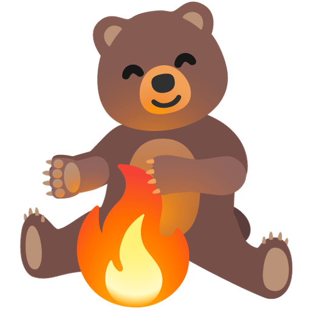

# Emoji Kitchen Examples

A collection of 36 emoji combination examples from Google's Emoji Kitchen service.

---

## Example Combinations

### People & Faces with Elements

| Combination | Result |
|-------------|--------|
| 😀 + 🔥 |  |
| 😀 + 💧 |  |
| 😊 + 🔥 |  |
| 😎 + 🔥 |  |
| 🥺 + 💧 |  |
| 😤 + 💨 |  |
| 😮 + 💨 |  |
| 👻 + 🔥 |  |
| 💀 + 🔥 |  |

### Animals with Fire

| Combination | Result |
|-------------|--------|
| 🐱 + 🔥 |  |
| 🐶 + 🔥 |  |
| 🦊 + 🔥 |  |
| 🐻 + 🔥 |  |

### Animals with Water

| Combination | Result |
|-------------|--------|
| 🐸 + 💧 |  |
| 🐢 + 💧 |  |
| 🐟 + 💧 |  |

### Animals with Hearts

| Combination | Result |
|-------------|--------|
| 🐱 + ❤️ |  |
| 🐶 + ❤️ |  |
| 🐻 + ❤️ |  |
| 🐰 + ❤️ |  |
| 🐵 + ❤️ |  |

### Classic Combinations

| Combination | Result |
|-------------|--------|
| ❤️ + 🔥 |  |
| 🐱 + 🌟 |  |
| 🎂 + 🎁 |  |
| 😎 + 🌴 |  |
| 🌈 + ☁️ |  |
| 🦄 + ✨ |  |
| 🎃 + 👻 |  |
| 🍕 + ❤️ |  |
| 🦋 + 🌸 |  |
| 🌙 + ⭐ |  |
| 🎸 + 🔥 |  |
| 🐢 + 🌊 |  |
| 🎨 + 🖌️ |  |
| 🌺 + 🌴 |  |
| ⚽ + 🏆 |  |

---

## Usage

To download any of these combinations using the CLI:

```bash
# Example: Download the fire heart
emoji-kitchen ❤️ 🔥

# Example: Download with custom size
emoji-kitchen 🐱 🌟 --size 128
```

---

## API Information

All images are served via the Vercel API:
- **Base URL:** `https://emojik.vercel.app/s/{emoji1}_{emoji2}?size={size}`
- **Default size:** 80px
- **Available sizes:** 32, 64, 80, 128, 256, 512

---

**See the full [README](README.md) for installation and usage instructions.**
